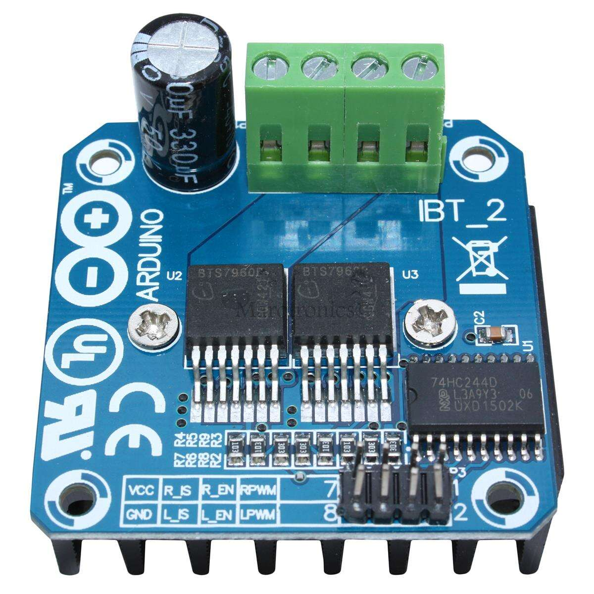
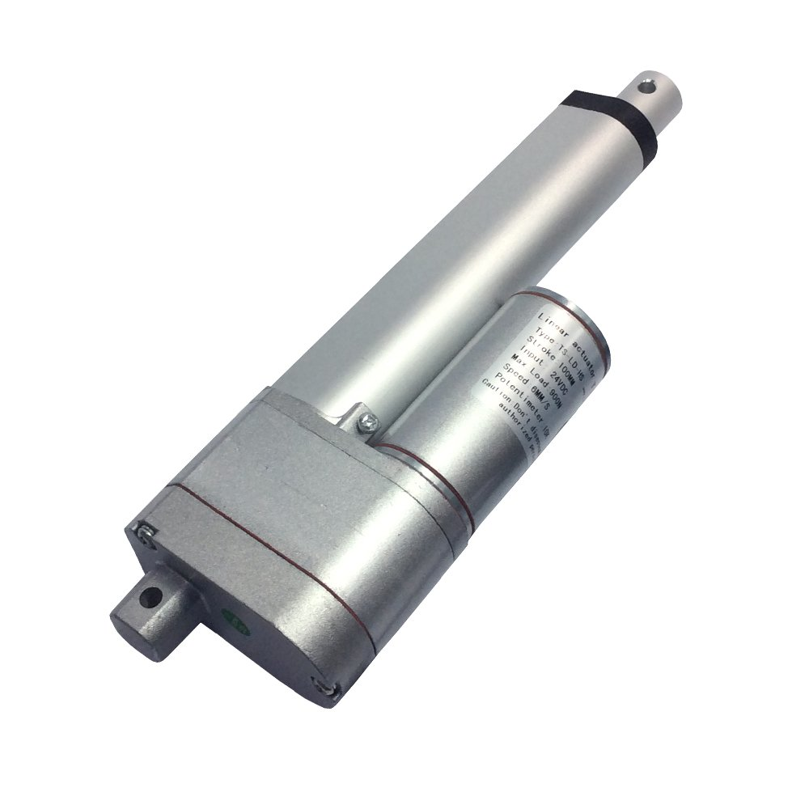

<!-- PROJECT LOGO -->
 

  
  <h1 align="center">BTS7960 Linear Actuator Driver</h1>
  <h2 align="center">Not Tested!!</h2>
  

    Control for potentiometer feedback linear actuator
     
    <strong>Designed and tested using STM32 Black Pill Built for Arduino.</strong>
     
     
    <a href="https://github.com/digitalbirth/BTS7960AD"><strong>Explore the docs »</strong></a>
     
    <a href="https://github.com/digitalbirth/BTS7960AD/issues">Report Bug</a>
    ·
    <a href="https://github.com/digitalbirth/BTS7960AD/issues">Request Feature</a>
    .
    <a href="https://www.paypal.com/cgi-bin/webscr?cmd=_s-xclick&hosted_button_id=YFJKGDDSEL7D2">Donate</a>
  

 
 

        
        

## How to use

### Define object

`BTS7960AD actuator(R_EN, R_PWM, R_IS, L_EN, L_PWM, L_IS, sensor, strokeLength, debug);`

### Pin out for BTS7960

1. RPWM Forward Level or PWM signal, **Active High**
2. LPWM Reverse Level or PWM signal, **Active High**
3. R_EN Forward Drive Enable Input, **Active High/ Low Disable**
4. L_EN Reverse Drive Enable Input, **Active High/Low Disable**
5. R_IS Forward Drive, Side current alarm output
6. L_IS Reverse Drive, Side current alarm output
7. Vcc +5V Power Supply micro-controller
8. Gnd Ground Power Supply micro-controller

## Methods
`BTS7960AD::getInstanceCount();`                    Get number of instances created with constructor

`actuator.init();`                                  Resets actuator id's in EEPROM. (important) only needs to be called once in set up

`actuator.begin();`                                 Sets up actuator pins defined in object and EEPROM memory positions.

`actuator.enable(true);`                            (True/ False) Enable driver pins R_EN and L_EN bringing them high. (May have issues - connected EN pins to the +ve rail so always on)

On initial start the calibrate function will test to see if there are values saved in EEPROM, if not it will fully extend and retract and record the min max values of the potentiometer and save to EEPROM as these can differ from the min max values due to gearing, when the board is re-powered, the values can be pulled from EEPROM saving loading time.

`actuator.calibrate(int speed);`                    (0 -255) Fully extends and retracts to record min max potentiometer values. 

`actuator.calibrationValues(int min, int max);`     Adds calibration data to eeprom

`actuator.calibrate(int speed);`                    (0 -255) Calibrates min / max length and potentiometer values

`actuator.recalibrate(int speed);`                  (0 -255) The actuators can be recalibrated by calling method, this is called from a button press in the example sketch.

`BTS7960AD::calibrateAll();`                        **TO DO** call to calibrate all actuators at the same time

`BTS7960AD::recalibrateAll();`                      **TO DO** call to recalibrate all actuators at the same time

`BTS7960AD::averageSpeed ();`                       Returns average speed for all actuators

`actuator.setSpeed(int newSpeed);`                  (0 -255) Sets speed for individual constructor

`actuator.stop();`                                                        Stops the actuator  

`actuator.moveToLimit(int direction, int speed);`                         (1 or 0 or -1, 0 -255)General full extension/retraction using min max readings

`actuator.moveToPercent(BTS7960AD* instance, int percent, int speed);`   **Needs testing** Control Actuator by percent (0-100) and direction (Retract-Extend)

`actuator.moveTo(uint32_t newPosition);`                                 (position in mm) Moves individual actuator

`actuator.moveAllTo(uint32_t position);`                                 (position in mm) Uses existing speed of all actuators to move to position in mm

`actuator.moveAllToAvgSpeed(uint32_t position);`                         (position in mm) Uses average speed of all actuators to move to position in mm

`actuator.moveAllToSetSpeed(uint32_t position, int speed);`              (position in mm, 0-255) Uses defined speed of all actuators to move to position in mm

`BTS7960AD::update();`                                                  Updates millis and calls update(now) which updates position of all actuators with a new target position set

`actuator.getPosition (void);`                                          Returns position in mm

`actuator.displayOutput();`                                             Displays serial output for debugging

(<a href="#top">back to top</a>)

## Methods inputs

### Direction

| Action  | Direction |
| ------------- | ------------- |
| Extend  | 1  |
| Stop  | 0  |
| Retract  | -1  |

### Speed

input value between 0-255

### Position

distance required in whole mm's along the length of the stroke

if 50mm stroke the value can be 0-50

(<a href="#top">back to top</a>)

<!-- ROADMAP -->
## Roadmap

- [ ] Add Calibration for multiple actuators - Test
- [ ] Synchronized motor movement function - Test
- [ ] Add position memory
    - [ ] Digital read buttons for memory positions

See the [open issues](https://github.com/digitalbirth/BTS7960AD/issues) for a full list of proposed features (and known issues).

(<a href="#top">back to top</a>)

<!-- CONTACT -->
## Contact

A simple star to this project repo is enough to keep me motivated on this project for days. If you find your self very much excited with this project let me know.

**Dean Bateman** 
- [https://www.linkedin.com/in/deanbateman/](https://www.linkedin.com/in/deanbateman/) 
- quotes@digitalbirth.com.au
- 

Project Link: [https://github.com/digitalbirth/BTS7960AD](https://github.com/digitalbirth/BTS7960AD)

(<a href="#top">back to top</a>)

## Coded by

        ____  _       _ __        __   ____  _      __  __
       / __ \(_)___ _(_) /_____ _/ /  / __ )(_)____/ /_/ /_    
	  / / / / / __ `/ / __/ __ `/ /  / __  / / ___/ __/ __ \   
	 / /_/ / / /_/ / / /_/ /_/ / /  / /_/ / / /  / /_/ / / /  
	/_____/_/\__, /_/\__/\__,_/_/  /_____/_/_/   \__/_/ /_/ 
            /____/    
        ------------ BRINGING YOUR IDEAS TO LIFE ------------                                      